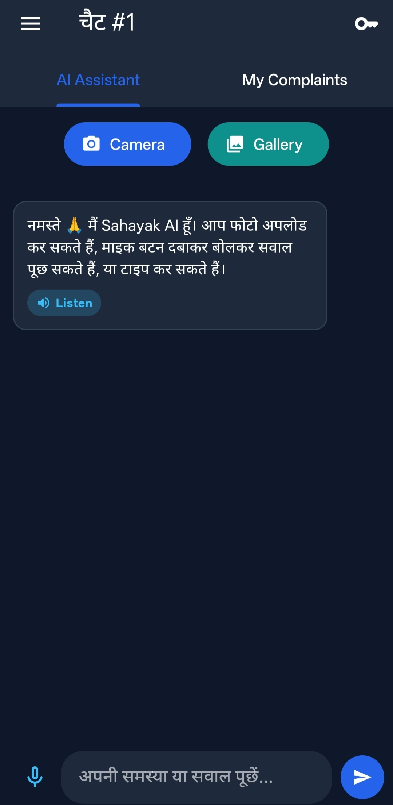

# 🏛️ Sahayak AI — Intelligent Civic & Student Assistant

<div align="center">

[](https://flutter.dev)
[](https://aistudio.google.com)
[](https://opensource.org/licenses/MIT)
[](https://github.com)

</div>

---

## 🌟 परिचय (Introduction)
**Sahayak AI** एक अत्याधुनिक मोबाइल एप्लीकेशन है जिसे नागरिकों और छात्रों की दैनिक समस्याओं को तुरंत हल करने के लिए डिजाइन किया गया है। यह ऐप **Google Gemini AI** की शक्ति का उपयोग करके नागरिक समस्याओं (जैसे- सड़क के गड्ढे, कचरा, जलापूर्ति की लीकेज) को समझता है, उन्हें स्वचालित रूप से संबंधित सरकारी विभाग को भेजता है और रियल-टाइम ट्रैकिंग की सुविधा देता है।

---

## 📱 ऐप के स्क्रीनशॉट्स (App Screenshots)

<div align="center">
  <table width="100%">
    <tr>
      <td align="center" width="50%"><b>AI Assistant & Chat Interface</b></td>
      <td align="center" width="50%"><b>Live Complaint Tracking</b></td>
    </tr>
    <tr>
      <td align="center"></td>
      <td align="center"></td>
    </tr>
  </table>
</div>

---

## ✨ मुख्य विशेषताएँ (Key Features)

* **🤖 Multimodal AI Analysis:** यूज़र कैमरे या गैलरी से किसी भी समस्या की फोटो अपलोड करता है, और जेमिनी एआई उसे गहराई से समझकर उसका सटीक विश्लेषण करता है।
* **🎫 Auto Ticket Generation & Tracking:** हर फोटो या शिकायत के लिए एक यूनिक टिकट आईडी (जैसे `SAH-1000`) जनरेट होती है, जिसे **'My Complaints'** टैब में लाइव ट्रैक किया जा सकता है।
* **⚡ Escalation & Remind System:** यदि किसी शिकायत का समाधान समय पर नहीं होता, तो यूज़र **'Remind'** बटन से विभाग को याद दिला सकता है या **'Escalate'** बटन से शिकायत सीधे वरिष्ठ अधिकारी के पास भेज सकता है।
* **🎙️ Voice & Multilingual Support:** बोलकर सवाल पूछने के लिए **Speech-to-Text** और एआई के जवाब को हिंदी आवाज में सुनने के लिए **Text-to-Speech (TTS)** का शानदार सपोर्ट।
* **💬 Multi-Session Chat Management:** साइड ड्रॉवर (Side Drawer) की मदद से यूज़र एक साथ कई अलग-अलग चैट्स मैनेज कर सकता है और पुरानी चैट हिस्ट्री हमेशा सुरक्षित रहती है।
* **🔒 Privacy & Security First:** सुरक्षा को ध्यान में रखते हुए कोई भी API Key कोड में हार्डकोड नहीं है। यूज़र अपनी खुद की फ्री Gemini API Key ऐप के अंदर सुरक्षित रूप से दर्ज कर सकता है जो केवल उसके फोन में लोकल सेव (`SharedPreferences`) रहती है।

---

## 🛠️ तकनीकी ढांचा (Tech Stack)
* **Frontend Framework:** Flutter (Dart)
* **AI Engine:** Google Generative AI (`gemini-3.6-flash`)
* **Local Storage:** `shared_preferences` & `path_provider`
* **Media & Audio:** `image_picker`, `flutter_tts`, `speech_to_text`

---

## 🚀 इंस्टॉलेशन गाइड (Installation & Setup)

यदि आप इस प्रोजेक्ट को अपने लोकल सिस्टम पर चलाना चाहते हैं, तो इन चरणों का पालन करें:

1. **Repository क्लोन करें:**
   ```bash
   git clone [https://github.com/rambinaypandit798-sudo/Sahayak-AI.git](https://github.com/rambinaypandit798-sudo/Sahayak-AI.git)
   cd Sahayak-AI
